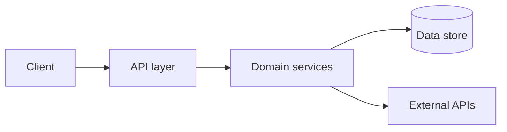

<!--
  Skeleton for the ONBOARDING.md that the project-onboarding skill produces.
  Copy this file to the target repo root as ONBOARDING.md, then fill every
  placeholder from real evidence and delete any section that does not apply.
  The reader is a human joining the project — keep it skimmable.
-->

# Onboarding — <project name>

> One-sentence purpose: what this repo is and who it serves.

## Stack & entrypoints

- **Language(s) / runtime:** <e.g. Node 20, Python 3.12>
- **Package manager:** <npm / pnpm / uv / cargo>
- **Entrypoints:** <files you actually run, e.g. `src/index.ts`, `cmd/server/main.go`>
- **Key dependencies:** <frameworks/libs that shape the code>

## Commands

| Task | Command | Notes |
|---|---|---|
| Install | `<...>` | |
| Build | `<...>` | |
| Test | `<...>` | |
| Lint | `<...>` | |
| Run (dev) | `<...>` | |

> Mark anything that mutates state (migrate, deploy, seed) — never run without asking.

## Architecture

<2–4 sentences: the major pieces and how a request/data flows between them.>

<!-- If pretty-mermaid rendered an SVG/ASCII, link it:  -->

## Conventions & constraints

- **Code layout:** <where source / tests / generated code live>
- **Naming & style:** <linters, formatters, naming rules worth knowing>
- **Do not edit:** <generated files, vendored dirs, lockfiles — and why>

## Gotchas & risky areas

- <Sharp edges: fragile modules, flaky tests, env-specific behaviour.>
- <Stale-index or cache traps; warn, never silently re-index.>

## Next actions

1. <First concrete step for a newcomer — e.g. run the test suite green.>
2. <Second step — e.g. trace one request end-to-end.>
3. <Open question or blocker to resolve before real work.>
