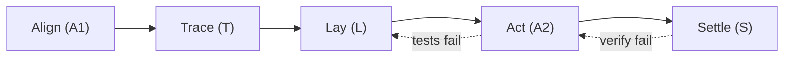

# Snail Agent Flow

<p align="center">
  
</p>

Snail Agent Flow is a local operating protocol for AI coding agents. It keeps specs, plans, validation gates, execution notes, reviews, and durable memory in predictable paths so a project can move from idea to release without scattered agent state.

It implements the **ATLAS Loop** (`Align → Trace → Lay → Act → Settle`), a 5-stage risk-adaptive execution protocol.

## Flow Design



### The 5 ATLAS Stages
- **Align (`align`)**: Scores task risk, claims work units, and selects risk profiles and work modes.
- **Trace (`trace`)**: Writes or updates specifications and slices them into checklists of independent tasks.
- **Lay (`lay`)**: Sets up failing tests, records git states, and acquires advisory file locks/leases.
- **Act (`act`)**: Iterative TDD execution of tasks/slices with strict loop limits.
- **Settle (`settle`)**: Verification, PR creation/shipping, code reviews, cleanup, and logging signals.

---

## Decoupled Risk Profiles & Work Modes

The protocol gates execution rigor by separating task taxonomy into two axes:

### 1. Risk Profiles (Rigor Scale)
Profiles are evaluated using a 5-dimension risk rubric:
- **FAST (Score: 0-2)**: Direct execution, targeted preflight, and Settle-Lite (skips PR shipping).
- **STANDARD (Score: 3-5)**: Spec-lite, tasks checklist, local verification, and Codex review pass.
- **FULL (Score: 6+)**: Comprehensive spec, implementation plans, peer review gate, Codex review, and human sign-off.

### 2. Work Modes (Stage Behavior)
- **FEATURE**: Standard path for new capabilities.
- **BUGFIX**: Focuses on root-cause isolation and repro test setup. Skips full spec.
- **PROTOTYPE**: Skips spec validation, skips PR shipping, and forces Settle cleanup.
- **REFACTOR**: Codebase maintenance enforcing regression testing.
- **DOCS**: Documentation updates. Skips test setup and coding iterations.

---

## Tool Map

| Layer | Tooling | Role |
|---|---|---|
| Constitution | Superpowers | Defines non-negotiable engineering behavior before work starts. |
| Canonical spec | Spec-Kit | Owns `specs/<feature-slug>/spec.md`, `plan.md`, `tasks.md`, and checklists. |
| Orchestration | Snail Agent Flow CLI (`adp` / `saf`) | Initializes paths, creates feature packets, tracks status, manages claims/leases, and logs signals. |
| Custom gates | ATLAS Skills | Custom control skills (`atlas-routing`, `atlas-gates`, `atlas-settle`, `atlas-review`). |
| Deterministic gates | Node.js validators | Checks spec headings, scans placeholders, detects drift, and creates human review packets. |
| Recon support | Serena, Semble, Context7, GitNexus | Codebase indexing, context lookup, semantic search, and impact analysis. |

---

## Repository Contract

| Path | Owner | Purpose |
|---|---|---|
| `.specify/` | Spec-Kit | Presets, templates, validation scripts, and the active feature pointer (`.specify/feature.json`). |
| `specs/<feature-slug>/` | Spec-Kit | Feature Spec Source of Truth (`spec.md`, `plan.md`, `tasks.md`). |
| `.claude/skills/` | ATLAS Loop | Custom ATLAS control skills (`atlas-routing`, `atlas-gates`, `atlas-settle`, `atlas-review`, `contracts`). |
| `.ai/` | Orchestration | Session logs, reviews, memory, and runtime metadata. |
| `.ai/state/flow-state.json` | Flow state | Durable execution state snapshot (replaces legacy `flow-ledger` and `run-state`). |
| `.ai/claims/` | Claims manager | Active work unit claims (`.ai/claims/*.json`). |
| `.ai/locks/` | Lease manager | Time-limited advisory file locks (`.ai/locks/*.json`). |
| `.ai/signals/` | Signal logger | Flow metrics and observability signals (`.ai/signals/current-period.jsonl`). |
| `bin/adp.js` | CLI | Zero-dependency local CLI command entry point. |
| `lib/` | Runtime | Core library (flow state, drift checks, CLI commands). |
| `validators/scripts/` | Gates | Offline test suites and verification scripts. |

---

## Quick Start

For detailed installation and setup, read [docs/installation.md](docs/installation.md).

```bash
# Install dependencies
npm install

# Initialize protocol directories
node bin/adp.js init

# Create and validate a new feature scaffold
node bin/adp.js run "Add user login"

# Check active status and current stage
node bin/adp.js status

# Run full project integrity checks
node bin/adp.js doctor
```

## CLI Reference

```
Commands:
  init                  Safely initialize required directories and template files.
  feature <description> Create a validated Spec-Kit feature scaffold.
  run <description>     Initialize, create a feature scaffold, and validate it.
  new-session <name>    Create a new session log file and update active feature.
  status                Display active feature name, current phase, and gate status.
  doctor                Run static project integrity checks and validations.
  validate-spec         Run the deterministic specification validation gate.
  handoff               Validate memory handoff checklist completeness.
  score <task.json>     Score task risk and output profile selection.
  claim <task-slug>     Claim work unit ownership.
  lease <file>          Acquire advisory file lease lock.
  checkpoint            Write profile-switch checkpoint.
  signal <type> <val>   Log observability signal.
```

---

## Reference Docs

- [Pipeline vocabulary](CONTEXT.md)
- [Full pipeline blueprint](docs/prd.md)
- [ATLAS Loop PRD v4.1](docs/prd-v4.1.md)
- [ATLAS Loop PRD v4.2](docs/prd-v4.2.md)
- [Artifact registry](docs/artifact-registry.md)
- [Tool routing matrix](docs/tool-routing.md)
- [Memory versus sessions](docs/memory-versus-sessions.md)
- [Failure modes runbook](docs/runbooks/failure-modes.md)

