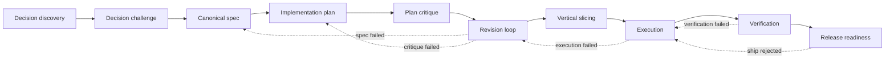

# Snail Agent Flow

Snail Agent Flow is a local operating protocol for AI coding agents. It keeps specs, plans, validation gates, execution notes, reviews, and durable memory in predictable paths so a project can move from idea to release without scattered agent state.

## Flow Design



The default `rough-project-flow` is a 10-stage sequential delivery loop. Each stage declares the skill or command to run, the artifacts it must produce, and where failures route next.

## Tool Map

| Layer | Tooling | Role |
|---|---|---|
| Constitution | Superpowers | Defines non-negotiable engineering behavior before work starts. |
| Canonical spec | Spec-Kit | Owns `specs/<feature-slug>/spec.md`, `plan.md`, `tasks.md`, and checklists. |
| Orchestration | Snail Agent Flow CLI (`adp` / `saf`) | Initializes protocol paths, creates feature packets, reports status, validates specs, and checks handoff state. |
| Execution | GSD | Consumes the canonical Spec-Kit artifacts and performs implementation, verification support, and handoff work. |
| Critique gates | GStack review tools | Runs product, engineering, QA, and ship-readiness review gates. |
| Deterministic gates | Node.js validators | Blocks drift with required headings, path checks, placeholder scans, retry state, and human review packets. |
| Recon support | Serena, Semble, Context7, GitNexus | Finds code context, current library docs, semantic matches, and change impact. |
| Projection and CI | GitHub Issues / GitHub Actions | Projects tasks from `tasks.md` and runs release/verification workflows. |

## Repository Contract

| Path | Owner | Purpose |
|---|---|---|
| `.specify/` | Spec-Kit | Templates, fixtures, workflows, validators, and active feature pointer. |
| `specs/<feature-slug>/` | Spec-Kit | Canonical feature source of truth. |
| `.ai/` | Orchestration | Mutable state, reviews, sessions, handoff, and durable memory. |
| `.ai/flows/` | Flow engine | Declarative flow definitions such as `rough-project-flow.yaml`. |
| `.ai/state/flow-ledger.json` | Flow ledger | Current stage progress and artifact state. |
| `bin/adp.js` | CLI | Zero-dependency local command entry point for `adp` and `saf`. |
| `lib/` | Runtime | Flow engine, ledger, init checks, parsers, and tool validators. |
| `validators/scripts/` | Gates | Deterministic validation and integration test scripts. |
| `docs/` | Humans and agents | Protocol references, ADRs, runbooks, and setup docs. |

## Quick Start

For installation, CLI commands, and verification commands, read [docs/installation.md](docs/installation.md).

```bash
npm install
node bin/adp.js run "Add user login"
node bin/adp.js validate-spec
```

## Reference Docs

- [Pipeline vocabulary](CONTEXT.md)
- [Full pipeline blueprint](docs/prd.md)
- [Artifact registry](docs/artifact-registry.md)
- [Tool routing matrix](docs/tool-routing.md)
- [Memory versus sessions](docs/memory-versus-sessions.md)
- [Failure modes runbook](docs/runbooks/failure-modes.md)
